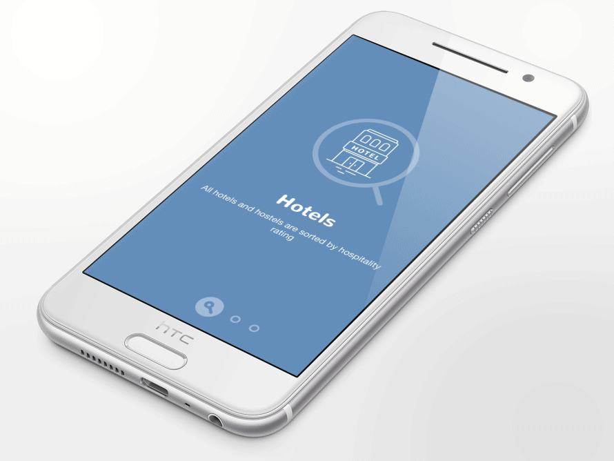

[](https://business.ramotion.com?utm_source=gthb&utm_medium=special&utm_campaign=paper-onboarding-android-logo)
# Paper Onboarding for Android
[](https://circleci.com/gh/Ramotion/paper-onboarding-android)
[](https://www.codacy.com/app/Ramotion/paper-onboarding-android?utm_source=github.com&amp;utm_medium=referral&amp;utm_content=ramotion/paper-onboarding-android&amp;utm_campaign=Badge_Grade)
[](http://twitter.com/Ramotion)

## About
This project is maintained by Ramotion, Inc.<br>
We specialize in the designing and coding of custom UI for Mobile Apps and Websites.<br><br>**Looking for developers for your project?** 

<a href="https://business.ramotion.com?utm_source=gthb&utm_medium=special&utm_campaign=paper-onboarding-android-contact-us/#Get_in_Touch" > </a>


[](https://dribbble.com/shots/2694049-Pagination-Controller-Open-Source)

The [Android mockup](https://store.ramotion.com?utm_source=gthb&utm_medium=special&utm_campaign=paper-onboarding-android) available [here](https://store.ramotion.com?utm_source=gthb&utm_medium=special&utm_campaign=paper-onboarding-android).

## Requirements
​
- Android 5.0 Lollipop (API lvl 21) or greater
- Your favorite IDE

## Installation
​
Just download the package from [here](http://central.maven.org/maven2/com/ramotion/paperonboarding/paper-onboarding/1.0.0/paper-onboarding-1.0.0.aar) and add it to your project classpath, or just use the maven repo:
​
Gradle:
```groovy
'com.ramotion.paperonboarding:paper-onboarding:1.1.0'
```
SBT:
```scala
libraryDependencies += "com.ramotion.paperonboarding" % "paper-onboarding" % "1.1.0"
```
Maven:
```xml
<dependency>
    <groupId>com.ramotion.paperonboarding</groupId>
    <artifactId>paper-onboarding</artifactId>
    <version>1.1.0</version>
    <type>aar</type>
</dependency>
```

## Basic usage

Paper Onboarding is a simple and easy to use onboarding slider for your app. You just need to provide content for each slider page - a main icon, text, and small round icon for the bottom.

1 Use `PaperOnboardingPage` to prepare your data for slider:
```java
PaperOnboardingPage scr1 = new PaperOnboardingPage("Hotels",
	"All hotels and hostels are sorted by hospitality rating",
        Color.parseColor("#678FB4"), R.drawable.hotels, R.drawable.key);
PaperOnboardingPage scr2 = new PaperOnboardingPage("Banks",
	"We carefully verify all banks before add them into the app",
        Color.parseColor("#65B0B4"), R.drawable.banks, R.drawable.wallet);
PaperOnboardingPage scr3 = new PaperOnboardingPage("Stores",
	"All local stores are categorized for your convenience",
        Color.parseColor("#9B90BC"), R.drawable.stores, R.drawable.shopping_cart);

ArrayList<PaperOnboardingPage> elements = new ArrayList<>();
elements.add(scr1);
elements.add(scr2);
elements.add(scr3);
```


2 Create a fragment from `PaperOnboardingFragment` and provide your data.
```java
PaperOnboardingFragment onBoardingFragment = PaperOnboardingFragment.newInstance(elements);
```

3 Done! Now you can use this fragment as you want in your activity, for example :

```java
FragmentTransaction fragmentTransaction = fragmentManager.beginTransaction();
fragmentTransaction.add(R.id.fragment_container, onBoardingFragment);
fragmentTransaction.commit();
```

4 Extra step : You can add event listeners to fragments with your logic, like replacing this fragment to another when the user swipes next from the last screen:

```java
onBoardingFragment.setOnRightOutListener(new PaperOnboardingOnRightOutListener() {
    @Override
    public void onRightOut() {
        FragmentTransaction fragmentTransaction = fragmentManager.beginTransaction();
        Fragment bf = new BlankFragment();
        fragmentTransaction.replace(R.id.fragment_container, bf);
        fragmentTransaction.commit();
    }
});
```
Currently, there are three listeners that cover all events - onRightOut, onLeftOut and onChange; see code examples and usage in the repo.

## Licence
​
Paper onboarding is released under the MIT license.
See [LICENSE](./LICENSE) for details.
​
## Follow Us

[](https://twitter.com/intent/tweet?text=https://github.com/ramotion/paper-onboarding-android)
[](https://twitter.com/ramotion)
